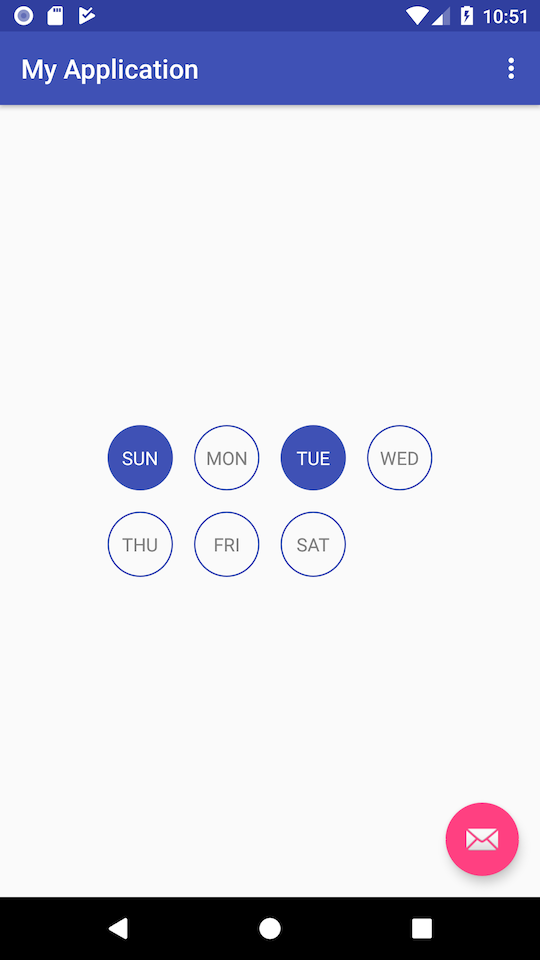
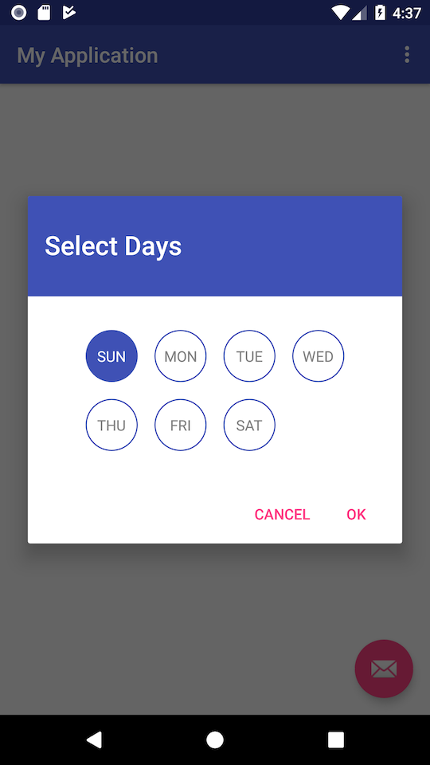
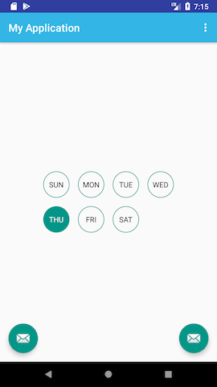
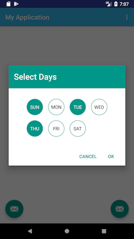

# SimpleDayPicker
A simple material design week day picker just like Time and Date pickers of Android support library. It's simple, light weight and works just like native Date and Time pickers you are used to.

 
 


You can use it as a view like any other view and also define it in XML code like below.

## Download

```
implementation "io.github.informramiz:daypickerlibrary:1.1"
```

## XML

```
<com.github.informramiz.daypickerlibrary.views.DayPickerView
        android:layout_width="wrap_content"
        android:layout_height="wrap_content"
        app:isMultiSelectionAllowed="true"/>
```

## Java
If you want to use it as a dialog like you use native Android Date/Time pickers, it's simple.

```
DayPickerDialog.Builder builder = new DayPickerDialog.Builder(this)
                .setMultiSelectionAllowed(false)
                .setOnDaysSelectedListener(new DayPickerDialog.OnDaysSelectedListener() {
                    @Override
                    public void onDaysSelected(DayPickerView dayPickerView, boolean[] selectedDays) {
							//do something with selected days
                    }
                });
builder.build().show();
```

## Theming 

**There are no hardcoded colors**, just like native Android pickers, this picker uses the theme colors you will define in your theme, including text and background colors. So you don't have to specify color manually, **the picker will automatically adapt to your app theme**. Still, if you prefer, you can specify a theme just any other alert dialog.

- For versions **v21 and above**, following color names in your **app/activity theme** will define the look of this picker

```
<style name="AppTheme" parent="...">
        <item name="colorAccent">...</item>
        <item name="colorControlHighlight">...</item>
        <item name="android:textColorPrimary">...</item>
        <item name="android:textColorPrimaryInverse">...</item>
</style>
``` 

- On versions **below v21**, following color names **must** be defined in your **colors.xml (not theme)** otherwise app will crash.

```
<color name="colorAccent">...</color>
<color name="colorControlHighlight">...</color>
```